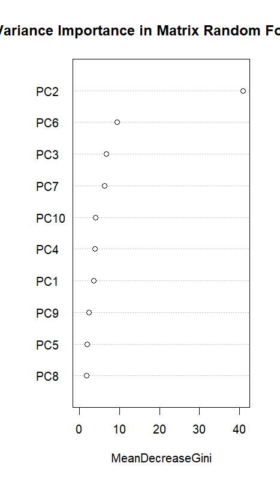
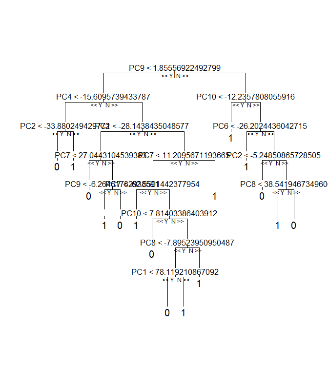
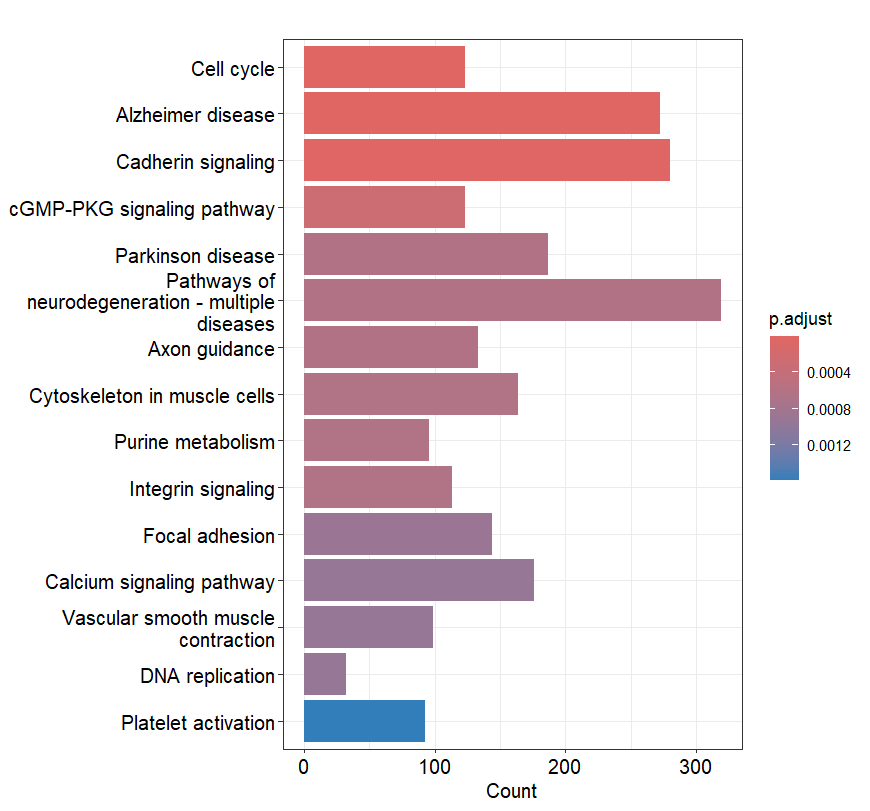
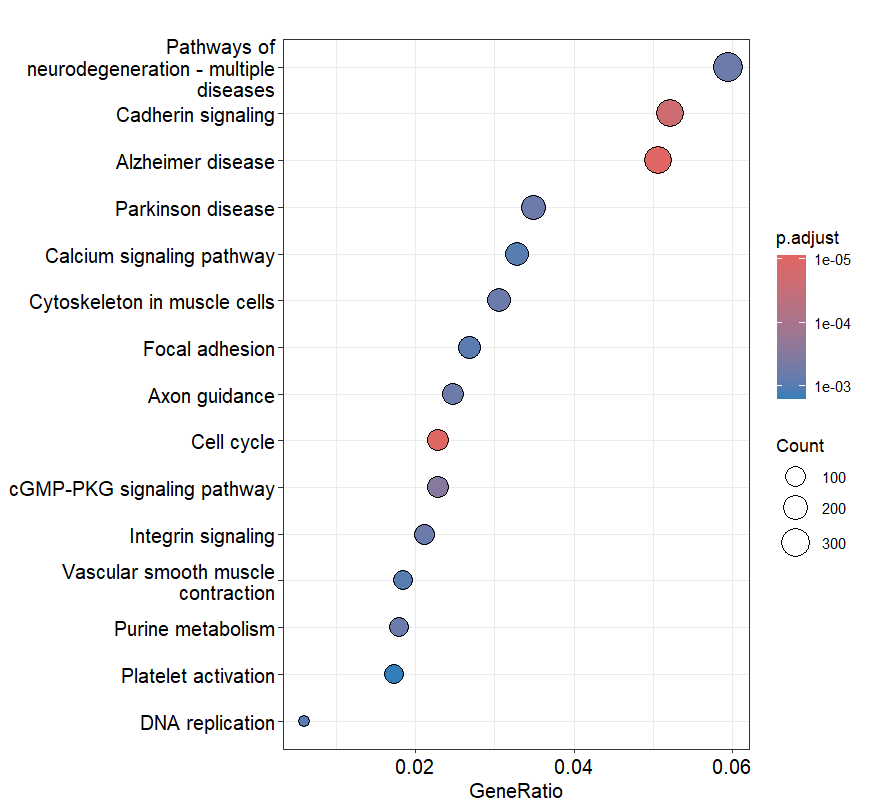

# Lung Cancer Classification in R
This R machine learning pipeline uses logistic regression, random forests, and XGBoost to classify normal and malignant tumors of a lung cancer dataset (GSE329380) from the Gene Expression Omnibus (GEO) of NCBI using bulk RNA-Seq data.  The pipeline ends with a pathway enrichment analysis to map genes.

# Background

Lung cancer is ranked #1 globally as the leading cancer that causes death. Causes include smoking, radon, asbestos, and other chemical carcinogens that cause malignant epigenetic changes that intervene functional cell checkpoints. While not all tumors are malignant, understanding differential expression patterns in various genes helps scientists to target relevant pathways when juxtaposed with normal transcriptomic data. Treatment usually includes radiation, surgery (e.g. lobectomy, pneumonectomy, resection), chemotherapy, stereotactic body radiotherapy, immunotherapy, and more.

**Dataset Description**

The machine learning pipeline uses the bulk RNA-seq data from an equal proportion of tumor and non-tumor lung tissue samples with 61852 genes and 204 patient samples. The original study used this data to understand the role of thrombopoietic programs in lung cancer, which drive blood platelet production.


**GEO LINK**
https://www.ncbi.nlm.nih.gov/geo/query/acc.cgi?acc=GSE329380

# Motivation

Understanding the genetic differences between normal and fatal tumors and accurately classifying tumors based on past data is important to avoid test errors and risk patient lives. Especially as contemporary society moves towards computational modeling, diagnosis, and innovative medicine production, training reliable models to facilitate treatment plans and tumor characteristics can allow healthcare professionals to spend more time on harnessing their technical expertise to support patients. In fact, targeted treatment through immunotherapy, AI-driven antibody discovery, and gene therapy are current examples of technology-driven innovative medicine.
This largely relies on existing expression data and mapping genes to pathways that explain other fatalities.

# Repository Structure
```
|-- Figures
|   |-- Barplot.png
|   |-- Dataframe-Based_Random_Forest_Tree.png
|   |-- Dotplot.png
|   `-- Variance_Importance_Plot.png
|-- GSE329380
|   `-- GSE329380_expr_count_lungcaner.csv.gz
|-- Packages
|   |-- Packages.R
|   `-- session_info.txt
|-- Table
|   `-- Representative_Model_Summary.csv
|-- src
|   `-- Lung_Cancer_Classification.R
`-- README.md
```
# Pipeline

**Data Preprocessing**

Label encoding: Converted gene expression counts from a dataframe to a matrix to perform numeric operations (e.g. isolating genes that are expressed in more than 3 samples).

Checked for null values.

Defined labels and expression data as a dataframe for differential expression analysis

One-Hot encoding was employed to define malignant tumors as "1" and normal tissues as "0".

**Differential Expression Analysis**

Analyzed genes that were overexpressed or underexpressed in tumor samples to understand what genes are involved with tumor proliferation.
This was done using the DESeq2 package from Bioconductor.

**Normalization and Dimensionality Reduction**

Raw numerical values were adjusted to accurately compare gene expression, removing technical noise while preserving true biological signals using the counts per million function.
Principal component analysis (PCA) was performed to compress the data into components, the top 10 of which could be used as the new features for model training.

**Model Training**

1. Logistic Regression

This is one of the interpretable classification models that fits a sigmoid function on the data. Based on a probability score and threshold (0.5), the sample is classified as malignant or normal.

The epsilon was treated as a hyperparameter representative of convergence tolerance where a model's improvement slows down (1e-8 and 1e-10).

2. Random Forest 

This is a form of ensemble learning in machine learning that combines decision trees to perform both regression and classification tasks, choosing the average prediction in the former task and the majority prediction in the latter task. A forest of trees are created through bagging or bootstrap aggregating, sampling with replacement and choosing random features for each subset of data. The majority vote for a tumor class was considered in the prediction. Moreover, random forests trained on data as a data frame and that as a matrix were run, with the matrices generally increasing accuracy. This is most likely because matrices compress the data into numeric features, while dataframes allow for mixed datatypes and are a collection of vectors. The randomForest package generally processes matrices more efficiently.
The number of trees was treated as a hyperparameter and stopping condition (500, 100, 50).

3. XGBoost

eXtreme Gradient Boosting is a gradient boosted decision tree algorithm used for classification and regression. With parallel processing, the model builds decision trees sequentially, such that the new tree learns from the mistakes of the previous tree through the residuals. Using a gradient algorithm, the aggregation of trees and computation of residuals allowed the model to improve and find tumor classifications and features that converge to a minimum point.

The number of rounds (nrounds) were treated as a hyperparameter (100, 500, 1000)


**Performance Evaluation**

1. The Akaike Information Criterion (AIC), confusion matrix, accuracy, and area under the curve  were evaluation tools and metrics in logistic regression. Both models had the same confusion matrix and similar results, so changing the convergence tolerance did not greatly affect model prediction. 1 out of 41 (2.44%) were misclassified (1 false negative).

2. Random Forest visualization, OOB estimate of error rate, confusion matrix, accuracy, and area under the curve were used as evaluation metrics and tools in Random Forest. Random forests trained on a matrix had the highest accuracy of ~95.71% for models with 500 trees, while those trained on a dataframe had the highest accuracy around 95.09% for the model with 500 trees. In the best matrix-based model, 7 out of 163 (4.29%) samples were misclassified (2 false positives and 5 false negatives. In the best dataframe-based model, 8 out of 163 samples were misclassified (3 false positives and 5 false negatives). Based on these results, 500 trees in a matrix-based random forest yield more accurate tumor classification. However, this must be taken with caution, given the risks associated with false negatives and missed diagnosis.

3. Prediction probability, confusion matrix, and area under the curve were evaluation metrics and tools in XGBoost. All three models showed similar performance, with 87.8% accuracy. 5 out of 41 samples (12.20%) were misclassified (4 false positives and 1 false negative).


**Feature Importance**
1. An odds ratio was used to understand which features increase or decrease the odds of the outcome: PC2 (increase), PC3 (decrease)
2. Importance scores were used to determine feature importance in Random Forest: PC2, PC3, and PC7.
3. The importance attribute of the XGBoost package was used to determine feature importance in XGBoost based on gain, cover, and frequency: PC2, PC1, and PC3 in order of most gain, cover, and frequency. There was no difference in accuracy based on the area under the curve and confusion matrix. 
It can be concluded that PC2 and PC3 have the most predictive power based on the odds ratio and importance scores. Note, PCA compresses the variance and does not deliver raw gene data, so biological interpretation is limited in terms of the driving factors behind prediction weight. To understand the biology behind the cancerous tumors, associated molecular pathways are considered later in the pipeline.

**Visualization and Mapping Genes**


The variance importance plot from the random forest model shows that PC2 and PC3 contribute the most to the tumor classification.


The decision structure of one of the trees of the ensemble for the dataframe-based random forest was plotted as a representative tree to make the model decisionmaking process more interpretable. This tree shows how the first few nodes contain a comparison with PC2 and PC3 before moving down the decision tree, illustrating their importance in the classification decision.



Based on the Kegg results, most of the differentially expressed genes in the tumors are linked to pathways of neurodegeneration, cadherin signaling, and Alzheimer's disease. In fact, neurodegeneration and cancer stem from inverse cell patterns, where the former is linked to premature apoptosis and the latter is cell proliferation. This inverse correlation suggests that patients with Alzheimer's or Parkinson's disease have decreased susceptibility to lung cancer because of the opposite cell cycle regulation patterns. Both disease types rely on tumor suppressor genes like p53. However, they still share similarities like increased risk with age (40-80). Moreover, both disease types are started by abnormal mitogenic triggers that intervene in the cell cycle.

However, the barplot and dotplot show the least gene association with DNA replication and platelet activation, despite many cancer genes upregulating DNA replication to increase cell division. Moreover, the original study conducted through this dataset discussed the thrombopoietic programming involved with lung cancer, where the general trend is hyperactivation of platelets. Thrombopoietic programming is the blueprint for this activation, but this dataset's pathway analysis illustrates low platelet activation compared to other pathways. This is surprising because platelet hyperactivation is common in lung cancer as an immunosuppressant and driver of TGF-Beta 1, which promotes cell proliferation, especially in cases of tissue injury and wound healing. Increased platelets generally encourage metastasis and angiogenesis, where tumors are nourished by blood vessels and invade neighboring oxygen supply. Therefore, further RNAseq datasets must be explored to map more differentially expressed genes and re-evaluate potentially the same genes to make a more confident biological conclusion about the role of DNA replication and platelet activation specifically in lung cancer.


**Discussion**

Overall, logistic regression has the highest accuracy, with both variations having 97.56% accuracy. However, the modeling cycle stages must be revisited to improve preprocessing with other encoding methods, organize the pipeline more, and try to minimize false negatives. More hyperparameters should be explored to see how performance fluctuates.Trusting a model with false negatives, which all three had, is dangerous in terms of diagnosing a patient. Due to the costliness of false negatives, next steps will be to evaluate performance through recall to analyze the true positive rate over the sum of both the true positive and false negative rates. Therefore, even as these models become refined, retrained, and re-evaluated with more data, they cannot be trusted blindly for a diagnosis. The unexpected results in terms of DNA replication and platelet activation genes being low in number also trigger the need for further investigation and analysis using core data science principles that align with the data and modeling cycle. Moreover, the Out-of-Bag (OOB) error was a statistical decision to determine performance due to the aggregated bagging algorithm missing some data when sampling with replacement across 500 trees. However, the dataset of 204 samples is not large enough to make this method reliable, and the model was also trained across 50 trees. However, the overall accuracy of all the models were fairly high with over 87%. There is about an even split between normal and cancerous classifications as the original data contains, which makes the majority of these models accurate. Next steps include integrating cross-validation to prevent overfitting which may have skewed current results and making more visualizations during preprocessing and modeling (specifically for XGBoost) to make better analyses about which classifications are more accurate. However, accuracy should not be misunderstood for reliability. Therefore, paired with human critical thinking and scientific testing, it can be used as a resource to facilitate diagnosis and treatment plans. 

# Packages
BiocManager, randomForest, devtools, xgboost, caret, pROC

# Author 

Aarthi Bharathan B.S. Computational & Applied Mathematics and Statistics in Mathematical Biology, College of William & Mary 
